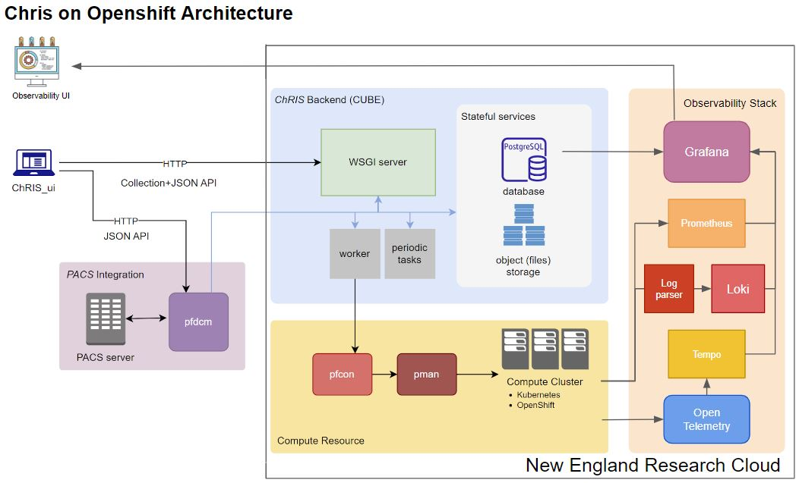
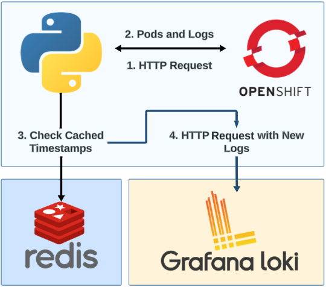

#  ChRIS

**Project Title: Observability in Cloud Processing with ChRIS**

**Project Members:**

*Timothy Borunov*

*Trevor Chan*

*Juehao Lin*

*Jakub J. Zolkos*

*Kwadwo Osafo*

## Demos
1. https://drive.google.com/file/d/1Axx8GrT3clQa5lssAnyzJHwH4feowfGC/view?usp=sharing
2. https://drive.google.com/file/d/1aYLyDDNu-SmBYTxwsuIl-jK45QH2584X/view?usp=sharing
3. https://drive.google.com/file/d/1z8EK8kX2ZMsnE-lOJcVe7RWCCgw8Tx6f/view?usp=share_link
4. https://drive.google.com/file/d/1OkuV4mA_2Lg1DOVdBiHQvjaF_nx1uTKo/view?usp=sharing
5. https://drive.google.com/file/d/1fSR-LywV1zZ0LXFZySAKkt9onQjbMQuZ/view?usp=sharing

## Slides
1. https://docs.google.com/presentation/d/1uQZDqBO68dm8y8CGtNuRPLEEiHiHIV6-TL68J6gDX1s/edit?usp=sharing
2. https://docs.google.com/presentation/d/104KnspHmhHB2cOUBCFunhCvKucEYojla4FEDy1epa-Q/edit?usp=sharing
3. https://docs.google.com/presentation/d/1yVFH7lIDybriKgPqWTtAD3MTj43_xSnPQzxWOS_pQPo/edit?usp=sharing
4. https://docs.google.com/presentation/d/1BI1rD-tRcoJzUx-eaui4UmoLWg_6-UTABwnEXXe-Dco/edit?usp=sharing
5. https://docs.google.com/presentation/d/1xKnhJAh5pmwp5lByy6W7FPNQM-zQxIx04AkgTJPpVnY/edit?usp=sharing
Final: https://docs.google.com/presentation/d/118gJM512Wck25joPERs0Wa2HoQq3fpU1fwHCX-8DSAc/edit?usp=sharing

## Table of Contents

1. [Vision and Goals of the Project](#1-vision-and-goals-of-the-project)
2. [Users of the Project](#2-userspersonas-of-the-project)
3. [Scope and Features of the Project](#3-scope-and-features-of-the-project)
4. [Solution Concept](#4-solution-concept)
   - [Global Architecture of the Project](#global-architecture-of-the-project)
   - [Development of Observability Stack](#development-of-observability-stack)
   - [Deployment on the New England Research Cloud (NERC)](#deployment-on-the-new-england-research-cloud-nerc)
   - [Design Implications and Discussion](#design-implications-and-discussion)
5. [Minimum Acceptance Criteria](#5-minimum-acceptance-criteria)
6. [Release Planning](#6-release-planning)

---

## 1. Vision and Goals Of The Project

The ultimate vision of this project is to transform ChRIS, a container scheduler for complex medical analysis tasks, into a highly observable and data-driven medical analysis platform, while maintaining simplicity for end users. We have implemented an observability stack for monitoring metrics about the ChRIS system such as CPU utilization for system admins maintaining the system in real-time, as well as metrics about the performance of individual ChRIS plugins. Additionally, we have a system in place to gather logs and traces of the general system which we are able to expose for use by system admins. All of this we have tested by deploying ChRIS to the New England Research Cloud (NERC) with the entire observability stack.

High-Level Goals for improving ChRIS include:

* Implement robust observability stack for ChRIS to collect critical performance data of the system and individual plugins
* Provide a simple, understandable interface for visualizing and monitoring the observability data (e.g. Grafana dashboard) for system administrators
* Configure observable instances of ChRIS with OpenShift and Helm
* Deploy ChRIS on the New England Research Cloud (NERC) with the observability stack and be able to run ChRIS plug-ins and obtain meaningful observability data

Below are definitions of some terms that will be frequently encountered in this README file:
* Plugin:
Container image used for running computational workflows in ChRIS
* Instrumentation:
Setting up a system such that its components emit meaningful traces, metrics and logs

## 2. End Users Of The Project

ChRIS observability tools will be used by healthcare system administrators to provide active statistics on the performance of ChRIS’s backend and individual tasks in the ChRIS container scheduling system. They will mainly be used by expert users for the sake of improving and maintaining the efficient functionality of the ChRIS system during its operation, as well as allowing system administrators to track trends in how ChRIS is performing and being used. However, it my also be useful for the Medical employment sector in order to track the performance of their ChRIS plugins running medical data workflows, however interface for non-expert users is not yet implemented.

##### System administrators (Primary users):

* Monitor performance metrics and maintain the system
* Track metrics such as CPU utilization and information like recent errors for maintaining the service in real-time
* Track trends in plugin use such as resource use by plugin image type and plugin use by users over time
* Will have access to a user-friendly interface (e.g. Grafana dashboard)

## 3. Scope and Features Of The Project

ChRIS is already a functional container scheduler used for performing data analytics tasks for medical professionals. However, the system currently does not have automated observability procedures tied to the ChRIS platform which can be used to view internal statistics and performance. Our scope will be not to improve the ChRIS system, but to utilize ChRIS using Openshift and to provide easy-to-use observability tools using a software stack.

The scope consists of two parts: Implementation of ChRIS with scripts for boot with Openshift, and research and implementation of an easy-to-boot observability software stack with a user interface. 

The primary scope of the project will consist of the following:

* Research observability stack alternatives to LGTM model and select optimal software for integration with ChRIS
    * Deploy backend for ChRIS container logging
    * Collect essential information about running container
* Implement observability architecture for a system administrator
    * Automatically collect and query generated logs from containers
    * Visualize collected data on the administrator’s interface
    * Create useful visualizations for gathering plugin metrics, system performance metrics, and system logs
* Learn how to utilize Openshift on the New England Research Cloud (NERC) and use that implementation with ChRIS
    * Deploy ChRIS on the NERC using OpenShift
    * Create a Helm project for deploying ChRIS and the observability stack on OpenShift
* Create an easily readable interface for end users (separate from administrator’s interface)
    * Implement a user-friendly dashboard UI
* Test and develop new observability methods and tools for usage with ChRIS
    * Explore possible optimization for logging and log storage
    * Explore the possibility of implementing an automatic alert system for system administrators

## 4. Solution Concept

### Global Architecture of the Project

The foundation of our project will revolve around the deployment of ChRIS on the New England Research Cloud (NERC), along with an observability stack which we will configure to ensure efficiency and robustness of deployment. Additionally, we aim to develop a robust configuration for ChRIS along with an efficient observability stack on OpenShift through the NERC, and we plan to deliver that through the Helm framework. Finally, we also seek to improve the observability capabilities of our deployed observability stack by using the data it collects to develop new modules or features, either in the observability stack or in the ChRIS application itself. Details of the architecture of the various components in our proposed system are highlighted in the subsections below.

### Development of Observability Stack:

Our observability stack adopts the observability stack paradigm for collecting and monitoring metrics including CPU and memory usage, resource allocation patterns, and temporal distribution of medical analysis programs for system management purposes. Metrics are collected and visualized in a dashboard for easy access and monitoring by system admins. It consists of the following components providing functionality for log collection, visualization, traces and metrics:

- #### Loki: Loki is a log aggregation system designed to store and query logs from all the deployed applications and infrastructure in ChRIS.

- #### Grafana: Grafana is a multi-platform open-source analytics and interactive visualization web application. It provides easy visualization of data into charts, graphs, and alerts for the web when connected to supported data sources.

- #### Tempo: Tempo is a high-volume tracing backend which efficiently implements distributed tracing on a large scale without the need for specialized clusters. Tempo also allows for efficient capture and storage of individual, exact traces.

- #### OpenTelemetry: OpenTelemetry provides a single, open-source standard for instrumenting, generating, collecting and exporting telemetry data (logs, metrics, traces). OpenShift on NERC has pre-installed OpenTelemetry auto-instrumentation and collection operators, which can be connected to other tools in our deployed observability stack, such as Prometheus and Tempo, for further processing.

- #### Prometheus: Prometheus collects and stores its metrics as time series data, i.e. metrics information is stored with the timestamp at which it was recorded, alongside optional key-value pairs called labels which can be sent to Grafana for visualization.

#### LGTM Stack Alternatives
Although using this observability stack setup is our foremost design choice, we have researched into OpenObservability and the ELK (Elasticsearch, Logstash, Kibana) observability stacks as possible alternatives. OpenObservability is advertised as a simpler, cheaper alternative to traditional Observability stacks. Although it's marketed as being easier to deploy and cheaper for storage, we ultimately decided not to use it because it is relatively new and so it would lack the documentation and support that more widely-used Observability stacks like LGTM have.

For ELK, one of its most prominent features is efficient log parsing by content. Although this was something that may be interesting to implement, we ultimately chose to go with the LGTM Observability stack because of the better flexibility it offers, as well as because of the ELK stack's focus on log analytics.

### Deployment to the New England Research Cloud (NERC)

A big part of the project will also be testing and automating the deployment of ChRIS with the observability stack on the NERC. The model that we will be following is shown in **Figure 1**.

- ##### OpenShift: OpenShift is the RedHat container scheduler powered by Kubernetes that the New England Research Cloud uses for developing and deploying applications. We will be using OpenShift for deploying ChRIS onto the NERC so that we can test that our observability stack is gathering, storing, and visualizing metrics correctly.

- ##### Helm: Helm is a software packaging manager that makes it easier to deploy applications to OpenShift clusters. We have created a collection of helm projects which are united in one script which automates the deployment of ChRIS and the observability stack onto OpenShift for ease of deployment to the NERC or similar Openshift environment.

OpenShift on NERC possesses two tools and operators that we use directly in our observability stack; an in-built Prometheus tool and the OpenTelemetry operator. The OpenShift Prometheus tool allows us to scrape simpler metrics such as CPU and memory usage which can then be exported to our deployed Grafana tool for display to our users. However, it does not collect more detailed metrics or HTTP requests, hence in the future it would be good to deploy a custom instance of Prometheus which will allow us to do this. We also use OpenTelemetry auto-instrumentation and collector tools to allow us to collect and aggregate all telemetry data (i.e. logs and traces in particular), which can then be exported to the other tools on our observability stack.

**Figure 1: Diagram of What Observability Stack Will Look Like in the NERC**

* Generate more data regarding the interactions between ChRIS and its plug-ins, and the Kubernetes environment (i.e. how the apps consume resources on this platform, possible bugs/optimizations, etc.)
* Promoting integration between high-level computing and the fields of healthcare and medical research
* Increasing accessibility of complex applications to end users on various cloud platforms (i.e. with ChRIS deployed on NERC, accessing complex and efficient medical tools becomes more ubiquitous and accessible to potential end users such as small clinics or medical researchers)
* Allow for easily understandable visualization of ChRIS system metrics for monitoring and system administration purposes
* Generate more data comparing the efficiency of different observability stack implementations, especially as related to observing applications with similar container management features as ChRIS

## 5. Acceptance Criteria

The minimum viable product is:

* A version of ChRIS which runs on NERC integrated with Openshift
* The version of ChRIS should also have attached observability tools able to run using the new Openshift applications
* Implement an automated alert systems that notifies system admins of anomalies and breaks in the system (but not for every plugin failure)
* Gather and display telemetry data (logs, metrics, traces)
* Bash scripts containing configuration for deploying ChRIS on Openshift and observability stack

Stretch goals are:

* Explore other observability options and possible optimizations, such as OpenObserve, ELK observability stack, etc.
* Create a user-friendly frontend on top of the observability stack
* Create an automated testing suite for analyzing the performance of the observability stack itself
* Gather traces for debugging ChRIS's existing problem with overhead delays

## 6. Release Planning

### Release #1 (Sep 27 - Oct 11):

* Deployed backend and frontend for ChRIS on New England Research Cloud (NERC)
* Researched each required part of observability stack for our project as well as topics in Openshift and ChRIS code

### Release #2 (Oct 11 - Oct 25):

* Deployed remaining parts of ChRIS (pfcon and pman) and tested that plugins run successfully
* Started deploying Observability stack
   * Deployed Grafana and Prometheus on NERC, allowing collection of metrics on Openshift containers
   * Researched into tracing tools and begin implementation
   * Deployed Open Telemetry core and collector (auto-instrumentation is not yet implemented)
* Split team to focus on metrics and logs, and traces separately

### Release #3 (Oct 26 - Nov 8):

* Deployed the rest of the Observability stack including Loki and Tempo
* Connected observability stack to gather metrics and logs

* Defined what it looks like when a plugin fails (in metrics and logs) and set up alerting system for failing plugins
* Defined what metrics are meaningful to observe and set up visualizations on Grafana for them

* Defined which parts of ChRIS to implement traces to
* Started deploying traces (looking into auto-instrumentation vs. manually implementing tracing in ChRIS source code)

### Release #4 (Nov 8 - Nov 22):

**Finishing With MVP**
* Deployed the rest of Loki and connect with Grafana
* Started visualizing the traces provided by Tempo and OpenTelemetry

* Finalized panels and alerts for monitoring system performance
* Finalized panels and alerts for monitoring for plugin failures
* Got experience as a ChRIS user to be able to easily generate plugin data

**Reach Goals**
* Started deploying custom traces in the ChRIS source code (reach goal)

### Release #5 (Nov 22 - Dec 8):

* Implemented an automated deployment of observability stack and chris without connections (Connections TBD)
* Created panels for analyzing trends in ChRIS plugin use
* Created alert for plugins that generate an error code (other than just CODE01)
* Wrote documentation on what we've done, including what panels are being used, what they're monitoring, and their settings 

## 7. Final Product

### Deploying ChRIS and the LGTM Observability Stack to the New England Research Cloud:
(overview of the difficulties we encountered with this)

#### Loki
For the purpose of collecting logs, we are using a monolithic Loki instance, which is a deployment mode in which all microservices associated with Loki run inside a single process as a single binary or Docker image. 
Normally, Loki deployments contain a component knows as a Promtail Agent, which is responsible for collecting logs from running pods and sending them to persistent storage provided by Loki, as Kubernetes does not provide one out-of-the-box. However, during the deployment of Promtail we ran into issues associated with permissions for using the cluster file system.

As a substitution, we have developed a log parsing Python script that leverages Kubernetes API, Loki API and a Redis database. The Kubernetes API is capable of accessing log JSON files from container runtimes by communicating with the kubelet on the node where the pod is running. Typically, for containers generated from Docker images default log configuration uses a driver which caps log files at 10MB and keeps up to three files before truncating the oldest logs. By default, each request for logs returns as many of past logs from those files as possible, therefore, it is important to reduce that number by only querying logs that were generated since last request. Our solution accomplishes that by caching the timestamp of each request on a Redis server in another pod, which enables to computing the elapsed time on the next iteration of the script. That time difference is then used as a parameter to the Kubernetes API which tells it to only quey most recent logs, and those logs are then passed to Loki via the Loki API push request.

### Grafana Dashboard:
Our Observability stack features Grafana, the data visualization platform that is able to connect to the previously mentioned components such as Loki and Prometheus. As a part of our project, we ingest the metrics, logs, and traces and create meaningful visualizations and alerting that is able to perform the following:
* Visualize ChRIS-specific plugin metrics and data for tracking ChRIS resource use and trends
* Visualize system performance metrics for system admins
* Visualize / monitor for recent plugin failures, and alert users upon plugins returning error codes
* Visualize recent ChRIS, plugin, and error logs

Our Grafana dashboard is split into three rows (groups of panels) for easy access to the specific types of information a system administrator might want to access:
1. Plugin Metrics
2. System Metrics
3. System
More in-depth Documentation on each panel, its configuration, and purpose can be found [here]([url](https://docs.google.com/document/d/1xAEXxO4ZIgSMIcy18iQHbfEJ1Av1hhoLwq5w3we1KdI/edit?usp=sharing))

#### Row 1 (Plugin Metrics)
ChRIS-specific plugin metrics for observing plugin resource use, trends in plugin use, and information that would be useful for system administrators to know about how ChRIS is being run

**Figure 2: ChRIS Grafana Dashboard Plugin Metrics Row**

**Panel 1: Resource Use by Plugin Type**
Display the amount of CPU use (in CPU use seconds), memory use (in GB), and runtime (in s) being used by a specified plugin type. The plugin type(s) whose resources are being displayed is set by the `$ChRISPluginImage` Grafana Dashboard Variable, which is configured for the dashboard as all plugin values queried from the connected ChRIS instance's PostgreSQL. This variable is displayed as a dropdown menu at the top as shown in the image below, where you are able to select single, multiple, or all plugin types. This is useful to visualize because it allows system admins to view the amount of resources being consumed by specific types of plugins as a time series graph.

**Panel 2: Number of plugins being run by Plugin Type**
Display the number of plugins being run. The left panel displays the number of plugins being run using the `$ChrisPluginImage` dashboard variable so that system admins will be able to view the resources being used by the selected plugin type(s) next to the number of plugins of those type(s) that are ran. The right panel displays the overall number of plugins being run with a separate field for each plugin type.

**Panel 3: Recent Plugin Errors Table**
Display the recent error codes and related plugin information for plugins that have returned error codes. Error codes are related to issues like failing to schedule the plugin on pfcon, so these plugin failures are of interest to system admins debugging failing plugins

**Panel 4: Number of Plugins Ran by User**
Display the number of plugins being ran organized by username. This could be useful for system administrators seeing which users are consuming ChRIS resources. Although it was a hope of ours to be able to expose directly the resource consumption by username, because we don't have our own Prometheus instance where we can add such labels we are unable to gather this information. This is implemented currently as PostgreSQL data represented as a time series graph based on the start and end times of when plugins are logged as running.

**Panel 5 & 6: Plugin Use Frequency & File Use Frequency**
Displays the global number of times that each plugin type has been run as a table, and displays the global count of each filename used by user. Panel 5 is useful for getting information on how ChRIS is being used such as which plugins are most often used for analysis, and panel 6 has been mentioned by our mentors as possibly being useful for users who want to get information on which files are used most frequently.

**Panel 7: Overall Plugin Resource Use**
Displays information on the overall amount of resources that each plugin image consumes. This includes the average and maximum CPU use, memory use, and runtime within the time period set by Grafana. This is useful for getting information on the amount of resources each plugin typically consumes. A limitation of this panel, however, is that it is unable to gather meaningful data for plugins with short runtimes (<15s), however our mentors have mentioned that these plugins may be less interesting for gathering this kind of information.

**Panel 8: Number of Plugins that have Exited with Success vs. Error Grouped by Week**
Display the sum of the number of plugins that have returned success and error each week. This is a panel that was mentioned in a ChRIS GitHub issue as something that may be interesting to expose for gathering information of how many ChRIS plugins have been failing and succeeding.

#### Row 2 (System Metrics)
General performance metric panels for overall system health and resource monitoring. Includes CPU use, memory use, and file system use panels for both the overall container scheduler system, as well as for the pods that follow the naming convention of plugin pods (chris-jid-*). These panels are useful for monitoring the overall health and resource use of the container scheduling system. It also includes gauges visualizing the CPU usage and memory usage % for Kubernetes limits and requests:

* CPU (Limits): Overall % of how pod CPU usage based on the amount allocated by Kubernetes
* CPU (Requests): Percentage of a given CPU period guaranteed to a pod

#### Row 3 (ChRIS Logs)
Panels showing the logs generated by the ChRIS system and gathered by Loki. These panels include one showing the most recent logs, one showing the most recent logs generated by pods following the ChRIS plugin pod naming convention, and one log showing the most recent logs including a ChRIS error code. These panels are useful for being able to better debug any possible anomalies found by directly being able to view the logs.

### OpenTelemetry (Traces generation & collection):
Our Observability stack implemented an auto-instrumentation subsystem & traces collection subsystem via OpenTelemetry. As part of the project, it enables the ChRIS system to generate traces and collect them for better observability. This subsystem can perform the following:
* Auto-instrument selected pod that annotated with a specific annotation
* Instrumented pod generates traces per request with related information
* Collector that collects & processes all the traces from instrumented pods

### Tempo (Traces storage & query):
Our Observability stack implemented the traces storage & query subsystem via Tempo. As part of the project, it enables the ChRIS system to store traces and provide query API and Route for Grafana. This subsystem can perform the following:
* Accept Traces data from OpenTelemetry collector via grpc protocol
* Store Traces for future query
* Provide outgoing route to access stored data
* Provide API to query traces with specific criteria

### Prometheus (Metrics storage & query)
Our Observability stack implemented the metrics storage & query subsystem via Prometheus. It enables the Observability stack to store metrics and provide query API and Route for Grafana. This subsystem can perform the following:
* Pull metrics data from Openshift API
* Store metrics data for future query
* Provide outgoing route to access stored data
* Provide API to query metrics with specific criteria

### Automated Deployment (in progress)
We have implemented two separate deployment scripts. Over the course of our project we realized the difficulty of deploying observability without access to cluster admin account on Openshift which led to use having to manually modify helm charts and application deployment. As such, we have a script which deploys a general observability stack which sets up all portions with Grafana, Loki, Open Telemetry, Tempo. There are some minor bugs with Prometheus that should be sorted out soon so we are currently not able to deploy Prometheus fully.
The current auto observability deployment consists of two scripts:
# observability.bash: 
This script launches the entire observability stack onto an openshift environment and all that it requires are the following:
* Openshift command line command access which can be done through the oc login command
* Installation of helm
* The files in this github in the same directory as the script: otel_py_instrumentation.yaml, grafana.yaml, tempo.yaml, otel_py_collector.yaml
The way you run the script is the following:
* Call the observability.bash script two command line arguments like so:
      <$0 [-a app_name (optional)] [-n namespace (mandatory)]>
* Namespace is the Openshift project name. If no appname is specified, just a default name is used.
* After running the script, it will ask for an email and password for that email to set up grafana notifications
* If successful, it should run to completition and output no errors and a message of done after each part of the observability stack
* The functions for connecting each routes for each observability are not fully implemented, but routes are output from the installation script, and all that is necessary is to paste them into datasources in grafana in order to connect each part of the observability stack. In the future, automated interaction with grafana will be implemented, allowing users to skip this step and automatically connect all observability with grafana.

To uninstall, just run uninstall.bash -a app_name

# chris_deploy.bash:
This script launches ChRIS on an Openshift environment with an option to automatically configure instrumentation for open telemetry. The requirements are as follows:
* Openshift command line command access which can be done through the oc login command
* Installation of helm
* The files in this github in the same directory as the script: chris_base.yaml, chris_annotated.yaml
The way you run the script is the following:
* Call the chris_deploy.bash script:
      <$ ./chris_deploy.bash>
You will be asked to enter a <release_name> and to choose whether or not to deploy an annotated instance of ChRIS
If successful and <release_name> is provided, a helm deployment called <chris-"release_name"> will be deployed on your cluster
If no release name is provided, the deployment will be called <chris>

To uninstall, run uninstall_chris.bash and provide the appropriate release name for your ChRIS deployment.

