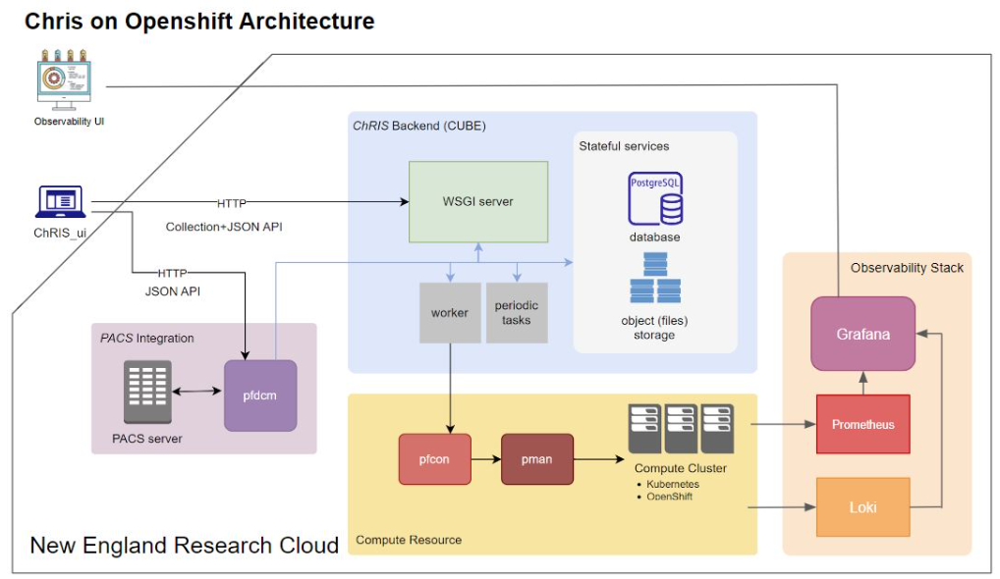

#  ChRIS

**Project Title: Observability in Cloud Processing with ChRIS**

**Project Members:**

*Timothy Borunov*

*Trevor Chan*

*Juehao Lin*

*Jakub J. Zolkos*

*Kwadwo Osafo*

## Demos
1. https://drive.google.com/file/d/1Axx8GrT3clQa5lssAnyzJHwH4feowfGC/view?usp=sharing
2. https://drive.google.com/file/d/1aYLyDDNu-SmBYTxwsuIl-jK45QH2584X/view?usp=sharing

## Table of Contents

1. [Vision and Goals of the Project](#1-vision-and-goals-of-the-project)
2. [Users of the Project](#2-userspersonas-of-the-project)
3. [Scope and Features of the Project](#3-scope-and-features-of-the-project)
4. [Solution Concept](#4-solution-concept)
   - [Global Architecture of the Project](#global-architecture-of-the-project)
   - [Development of Observability Stack](#development-of-observability-stack)
   - [Deployment on the New England Research Cloud (NERC)](#deployment-on-the-new-england-research-cloud-nerc)
   - [Design Implications and Discussion](#design-implications-and-discussion)
5. [Minimum Acceptance Criteria](#5-minimum-acceptance-criteria)
6. [Release Planning](#6-release-planning)

---

## 1. Vision and Goals Of The Project

The ultimate vision of this project is to transform ChRIS, a container scheduler for complex medical analysis tasks, into a highly observable and data-driven medical analysis platform, while maintaining simplicity for end users. We plan to implement an observability stack for monitoring metrics about the ChRIS system such as CPU utilization for system admins maintaining the system in real-time, and metrics about the performance of individual ChRIS plugins for end users. We will also test deploying ChRIS to the New England Research Cloud (NERC) with the observability stack.

High-Level Goals for improving ChRIS include:

* Implement robust observability stack for ChRIS to collect critical performance data of the system and individual plugins
* Provide a simple, understandable interface for visualizing and monitoring the observability data (e.g. Grafana dashboard) both for expert users such as system administrators and for non-expert medical researchers
* Configure observable instances of ChRIS with OpenShift and Helm
* Deploy ChRIS on the New England Research Cloud (NERC) with the observability stack and be able to run ChRIS plug-ins and obtain meaningful observability data

Below are definitions of some terms that will be frequently encountered in this README file:
* Plugin:
Container image used for running computational workflows

## 2. End Users Of The Project

ChRIS observability tools will be used by healthcare system administrators and medical researchers/personnel to provide active statistics on the performance of ChRIS’s backend and individual tasks in the ChRIS container scheduling system. They will mainly be used by expert users for the sake of improving and maintaining the efficient functionality of the ChRIS system during its operation. However, it will also be available for the Medical employment sector in order to track the performance of their ChRIS plugins running medical data workflows.

##### System administrators:

* Monitor performance metrics and maintain the system
* Track metrics such as CPU utilization and storage for finding any system errors and maintaining the service in real-time
* Will have access to a user-friendly interface (e.g. Grafana dashboard) with optional access to raw system logs

##### Non system admin users (not primary users):

* Simple use-cases for non-expert users (e.g. medical researchers or personnel) to easily monitor the performance of their individual plugins
* Assumes that users have experience using the ChRIS UI to be able to effectively use/understand the monitoring data
* Be able to schedule their jobs more efficiently through an easy-to-use, interactive interface separate from the expert user interface

## 3. Scope and Features Of The Project

ChRIS is already a functional container scheduler used for performing data analytics tasks for medical professionals. However, the system currently does not have automated observability procedures tied to the ChRIS platform which can be used to view internal statistics and performance. Our scope will be not to improve the ChRIS system, but to utilize ChRIS using Openshift and to provide easy-to-use observability tools using a software stack.

The scope consists of two parts: Implementation of ChRIS with scripts for boot with Openshift, and research and implementation of an easy-to-boot observability software stack with a user interface. 

The primary scope of the project will consist of the following:

* Research observability stack alternatives to LGTM model and select optimal software for integration with ChRIS
    * Deploy backend for ChRIS container logging
    * Collect essential information about running container
* Implement observability architecture for a system administrator or researcher
    * Automatically collect and query generated log from containers
    * Visualize collected data on the administrator’s interface
* Learn how to utilize Openshift on the New England Research Cloud (NERC) and use that implementation with ChRIS
    * Deploy ChRIS on the NERC using OpenShift
    * Create a Helm project for deploying ChRIS and the observability stack on OpenShift
* Create an easily readable interface for end users (separate from administrator’s interface)
    * Implement a user-friendly dashboard UI
* Test and develop new observability methods and tools for usage with ChRIS
    * Explore possible optimization for logging and log storage
    * Explore the possibility of implementing an automatic alert system for system administrators

## 4. Solution Concept

### Global Architecture of the Project

The foundation of our project will revolve around the deployment of ChRIS in the New England Research Cloud (NERC), along with an observability stack which we will configure to ensure efficiency and robustness of deployment. Additionally, we aim to develop a robust configuration for ChRIS along with an efficient observability stack on OpenShift through the NERC, and we plan to deliver that through the Helm framework. Finally, we also seek to improve the observability capabilities of our deployed observability stack by using the data it collects to develop new modules or features, either in the observability stack or in the ChRIS application itself. Details of the architecture of the various components in our proposed system are highlighted in the subsections below.

### Development of Observability Stack:

Our observability stack will adopt the observability stack paradigm for collecting and monitoring metrics including CPU and memory usage, resource allocation patterns, and temporal distribution of medical analysis programs for system management purposes. Metrics will be collected and visualized in a dashboard for easy access and monitoring by system admins. It will consist of the following components providing functionality for log collection, visualization, traces and metrics:

- ##### Loki: Loki is a log aggregation system designed to store and query logs from all the deployed applications and infrastructure in ChRIS.

- ##### Grafana: Grafana is a multi-platform open-source analytics and interactive visualization web application. It provides easy visualization of data into charts, graphs, and alerts for the web when connected to supported data sources.

- ##### Thanos: The Thanos query command (also known as “Querier”) implements the Prometheus HTTP v1 API to query data in a Thanos cluster via PromQL. It gathers the data needed to evaluate the query from underlying StoreAPIs, evaluates the query, and returns the result to Grafana for visualization. Thanos will allow us to efficiently store and transmit data.

- ##### Prometheus: Prometheus collects and stores its metrics as time series data, i.e. metrics information is stored with the timestamp at which it was recorded, alongside optional key-value pairs called labels which can be sent to Grafana for visualization.

Although using this observability stack setup is our foremost design choice, we will be researching using OpenSource as our observability stack and plan to compare the efficiency of its performance to that of the LGTM stack implementation and choose the option with the best performance.

### Deployment to the New England Research Cloud (NERC)

A big part of the project will also be testing and automating the deployment of ChRIS with the observability stack on the NERC. The model that we will be following is shown in **Figure 1**.

- ##### OpenShift: OpenShift is the RedHat container scheduler powered by Kubernetes that the New England Research Cloud uses for developing and deploying applications. We will be using OpenShift for deploying ChRIS onto the NERC so that we can test that our observability stack is gathering, storing, and visualizing metrics correctly.

- ##### Helm: Helm is a software packaging manager that makes it easier to deploy applications to OpenShift clusters. We will be creating a Helm project for automating deploying ChRIS and the observability stack onto OpenShift for ease of deployment to the NERC.

**Figure 1: Diagram of What Observability Stack Will Look Like in the NERC**

### Design Implications and Discussion:

* Generate more data regarding the interactions between ChRIS and its plug-ins, and the Kubernetes environment (i.e. how the apps consume resources on this platform, possible bugs/optimizations, etc.)
* Promoting integration between high-level computing and the fields of healthcare and medical research
* Increasing accessibility of complex applications to end users on various cloud platforms (i.e. with ChRIS deployed on NERC, accessing complex and efficient medical tools becomes more ubiquitous and accessible to potential end users such as small clinics or medical researchers)
* Allow for easily understandable visualization of ChRIS system metrics for monitoring and system administration purposes
* Generate more data comparing the efficiency of different observability stack implementations, especially as related to observing applications with similar container management features as ChRIS

## 5. Acceptance Criteria

The minimum viable product is:

* A version of ChRIS which runs on NERC integrated with Openshift
* The version of ChRIS should also have attached observability tools able to run using the new Openshift applications
* Helm project containing configuration for deploying ChRIS on Kubernetes with observability
* By the end of the project, we will have a pull request for [https://github.com/FNNDSC/charts](https://github.com/FNNDSC/charts) with our changes

Stretch goals are:

* Implement an automated alert system that notifies system admins of anomalies and breaks in the system
* Explore other observability options and possible optimizations, such as OpenObserve, ELK observability stack, etc.
* Create a user-friendly frontend on top of the observability stack
* Create an automated testing suite for analyzing the performance of the observability stack itself

## 6. Release Planning

### Release #1 (due by Week 5):

* Deploy backend for ChRIS on New England Research Cloud (NERC) and enable end-users to access ChRIS via NERC

### Release #2 (due by Week 7):

* Deploy observability on NERC and connect to ChRIS and enable system admins to collect logs generated from running containers

### Release #3 (due by Week 8):

* Implement a Dashboard in Observability that is useful to system admins and contains information about running containers

### Release #4 (due by Week 10):

* Work on finalizing version and submitting an official pull request to the ChRIS-helm project ([https://github.com/FNNDSC/charts](https://github.com/FNNDSC/charts)), achieve deliverable Minimum Viable Product

### Release #5 (due by Week 12):

* Work on stretch goals, including automated alert systems, friendly front end on top of observability stack, and/or automated function testing for existing dashboards
